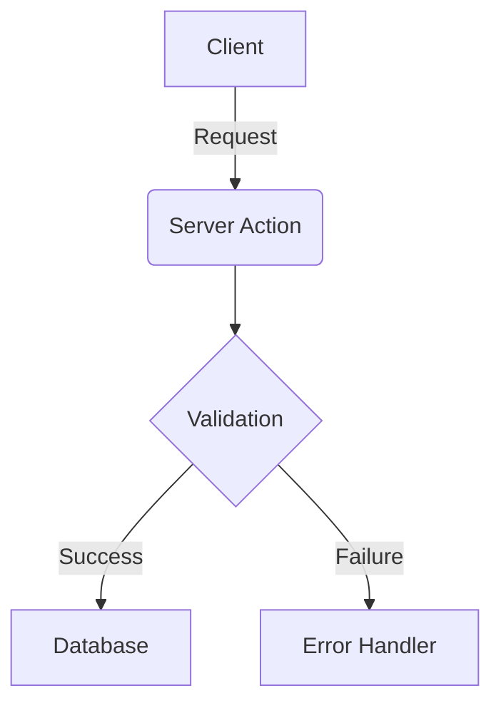

# Skill: arms-docs-generator
**Role**: Technical Documentation & Architecture Visualization Specialist.

## Purpose
Enables agents to generate, maintain, and update high-fidelity technical documentation and architectural diagrams using Mermaid.js syntax.

## Core Capabilities
1. **System Visualization**: Generate Mermaid Flowcharts, Sequence Diagrams, and ER Diagrams from source code analysis.
2. **Auto-Doc Maintenance**: Sync `README.md` and other documentation files with the latest architectural changes.
3. **API Documentation**: Generate and update OpenApi/Swagger-style documentation for server-side routes.

## Execution Protocols

### 1. Visualization Mandate
When requested to "visualize" a feature:
- Analyze the relevant directory for service relationships.
- Use `mermaid` code blocks.
- **Rule**: Diagrams must be embedded directly into `.md` files or exported to `.png` (if tools allow).

### 2. Documentation Structure
All technical docs generated by this skill must follow the **ARMS Standard Layout**:
- **Overview**: High-level purpose.
- **Flow**: Mermaid diagram showing logic progression.
- **Components/Routes**: Detailed breakdown of technical units.
- **Usage**: Clear examples or integration snippets.

## Example mermaid block:

