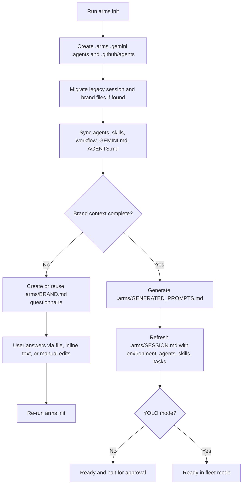

# ARMS — Architectural Runtime Management System

> **Multi-agent orchestration for full-stack delivery with persistent project state.**

ARMS is a Python-powered orchestration engine that bootstraps a project workspace for AI-assisted delivery. It installs a local control plane for planning, memory, skills, workflow references, and agent discovery so the same project can be resumed consistently across sessions.

The engine is optimized for **structured execution**, not just one-off prompting:
- it creates a persistent task board in `.arms/SESSION.md`
- it separates project state from global engine logic
- it captures brand, stack, and product context in `.arms/BRAND.md`
- it generates reusable implementation prompts once intake is complete

---

## What ARMS Actually Does

At a high level, `arms init` turns a folder into an ARMS-managed workspace:



---

## Core Architecture

ARMS uses a **hub-and-spoke** model.

### 1. Global engine

The installed package acts as the central engine:
- `arms_engine/agents/` — agent instruction files
- `arms_engine/skills/` — skill directories containing `SKILL.md`
- `arms_engine/workflow/` — reusable workflow protocols
- `arms_engine/agents.yaml` — canonical agent registry

### 2. Local project instance

When you run `arms init`, ARMS writes project-local state and mirrors:

| Path | Purpose | Notes |
|---|---|---|
| `.arms/SESSION.md` | Live orchestration board | Stores environment, active agents, active skills, task table, blockers |
| `.arms/SESSION_ARCHIVE.md` | Permanent task history | Created if missing and preserved across re-runs |
| `.arms/BRAND.md` | Brand + stack + product intake | Inferred for existing repos, questionnaire-driven for new projects |
| `.arms/MEMORY.md` | Persistent project memory | Created if missing, migrated from legacy `.gemini/MEMORY.md`, and append-only by convention |
| `.arms/GENERATED_PROMPTS.md` | Agent-ready prompts derived from intake | Generated only when the brand brief is complete |
| `.gemini/RULES.md` | Project rules and guardrails | Created if missing |
| `.gemini/GEMINI.md` | Managed Gemini config mirror | Re-synced from the engine |
| `GEMINI.md` | Project-root Gemini CLI instruction file | Re-synced from the engine so Gemini loads current ARMS init behavior |
| `.gemini/agents/` | Local mirror of agent markdown files | Synced from `arms_engine/agents/` |
| `.gemini/agents.yaml` | Local mirror of the canonical agent registry | Synced from `arms_engine/agents.yaml` |
| `.arms/workflow/` | Local mirror of workflow docs | Copied from the engine for cross-CLI use |
| `.arms/reports/` | Shared report output directory | Used by review, fix, and deploy protocols |
| `.arms/agent-outputs/` | Shared generated asset/output directory | Used for agent-produced files such as media assets |
| `.agents/skills/` | Local skill mirror for CLI discovery | Only valid skill directories with `SKILL.md` are synced |
| `.agents/skills.yaml` | Generated skill registry | Built from synced skill metadata |
| `.agents/skills-index.md` | Human-readable skill index | Generated quick reference |
| `.github/agents/` | Copilot CLI agent discovery | Synced from engine agent files |
| `AGENTS.md` | Copilot instruction file at project root | Re-synced from the engine |

---

## Installation

### Recommended: global install with `pipx`

```bash
pipx install git+https://github.com/imjohnlouie04/Arms-Engine.git
```

Then use ARMS in any project:

```bash
cd path/to/project
arms init
```

### Development install

```bash
git clone https://github.com/imjohnlouie04/Arms-Engine.git
cd Arms-Engine
pip install -e .
```

### Requirements

- Python `>= 3.8`
- `pyyaml`

---

## CLI Surface

The package exposes two entry points:

| Command | What it does |
|---|---|
| `arms` | Main workspace bootstrap and orchestration initializer |
| `arms-docs` | Updates the README agent roster block from `agents.yaml` |

`arms --version` and `arms-docs --version` are also supported.

---

## `arms init` In Detail

`arms init` is the main entry point. Internally it performs these steps in order:

1. Resolves the active project root.
2. Refuses to initialize the home directory as a safety guard.
3. Creates required folders such as `.arms/`, `.gemini/`, `.agents/skills/`, and `.github/agents/`.
4. Migrates legacy state into `.arms/` and `.gemini/` when older files are found, including previous root-level layouts such as `SESSION.md`, `RULES.md`, `GEMINI.md`, and `agents.yaml`.
5. Scaffolds missing runtime files like `.arms/MEMORY.md`, `.gemini/RULES.md`, and `.arms/SESSION_ARCHIVE.md`.
6. Removes the legacy `.gemini/skills/` mirror to avoid duplicate skill discovery.
7. Syncs agents, skills, workflow docs, `.gemini/GEMINI.md`, root `GEMINI.md`, and root `AGENTS.md`.
8. Creates or refreshes `.arms/BRAND.md` depending on project state.
9. Applies any intake helpers such as `--preset`, `--answers-file`, or `--answers-text`.
10. Generates `.arms/GENERATED_PROMPTS.md` when the intake is complete.
11. Refreshes `.arms/SESSION.md` with environment metadata, including the engine version that last synced the project, plus the agent roster, skill roster, and task sections. Explicit agent skill bindings come from `agents.yaml`; unbound discovered skills are auto-attached to the best-matching agent for session visibility.
12. Refuses to continue if an older installed engine tries to re-sync a project that was last synced by a newer engine version, unless you explicitly override the downgrade guard.
13. Ends in either standard halt mode or YOLO-ready mode.

### Standard mode

```bash
arms init
```

Use this when you want the normal approval-driven workflow. If brand context is incomplete, ARMS prints the questionnaire path and halts until you fill it.

### `start` alias

The parser also accepts:

```bash
arms start
```

At the moment, `start` follows the same bootstrap path as `init`.

### YOLO mode

```bash
arms init yolo
```

This enables the YOLO flag in the generated session state and changes the completion message to fleet mode. It also auto-accepts a session context overwrite if an existing `SESSION.md` points to a different project root.

### Compression mode

```bash
arms init compress
```

This currently **acknowledges optimization mode** and prints that the caveman skill stub was activated. The actual compression flow is not yet executed by the Python entry point, so this should be treated as a documented hook rather than a fully implemented compression pass.

### Overriding the engine root

```bash
arms init --root /path/to/arms_engine
```

Use this mainly for development or when you want to point a project at a non-default engine location.

### Allowing an intentional downgrade

```bash
arms init --allow-engine-downgrade
```

ARMS now records the engine version in `.arms/SESSION.md`. If a project was last synced by a newer engine and you run `arms init` from an older install, init stops and tells you to upgrade instead of silently downgrading project state.

Use `--allow-engine-downgrade` only when you intentionally want an older engine to re-sync the project.

### Watch mode / auto-resume

```bash
arms init --watch
```

When init halts because `.arms/BRAND.md` is still incomplete, watch mode keeps the process alive, watches the brand file, and automatically reruns `arms init` after the file changes.

This is useful when you want to:
- open `.arms/BRAND.md` in an editor
- fill in the missing fields
- let ARMS resume automatically without manually rerunning the command

Watch mode only auto-resumes the brand-intake checkpoint. Press `Ctrl+C` to stop watching.

---

## New Intake Features

The newer `init` flow is designed to collect structured project context before heavy implementation begins.

### 1. Presets with `--preset`

```bash
arms init --preset local-business
```

`--preset` fills **unanswered** fields in `.arms/BRAND.md` with opinionated defaults for a common project shape. It is meant to accelerate intake, not overwrite a fully written brief.

Available presets:

| Preset | Best for | What it pre-fills |
|---|---|---|
| `local-business` | Service businesses and local lead-generation sites | local SEO, CTAs, trust sections, contact visibility, service-gallery style content |
| `saas` | Product-led SaaS sites and app marketing | feature sections, pricing, onboarding clarity, product screenshots, conversion-oriented messaging |
| `portfolio` | Personal or agency portfolios | featured work, case studies, about/process, contact and proof-of-work structure |
| `ecommerce` | Storefronts and commerce-led projects | collections, product highlights, reviews, shipping/returns, purchase CTAs |
| `content-site` | Editorial or content-marketing properties | featured content, topic sections, newsletter CTA, content hierarchy, discoverability |

Each preset can populate fields such as:
- `Project Type`
- `Design Priority`
- `Voice & Tone`
- `Typography`
- `Icon System`
- `Experience Type`
- `Required Website Sections`
- `Primary Calls to Action`
- `Image Requirements`
- `SEO Focus`
- `Technical Constraints`

**Important:** preset application is non-destructive by default. If a field already contains a real answer, the preset leaves it alone.

### 2. Structured answer ingestion with `--answers-file`

```bash
arms init --answers-file .arms/answers.md
```

This reads a structured answer block from a file and applies it into `.arms/BRAND.md`.

It also supports stdin:

```bash
cat answers.md | arms init --answers-file -
```

### 3. Structured answer ingestion with `--answers-text`

```bash
arms init --answers-text "Mission: Build a modern local HVAC website"
```

Use this when you want to pass a compact answer block inline from the terminal.

### 4. Supported answer formats

The parser accepts multiple structured formats:

```text
Mission: Build a modern local HVAC website
Primary Audience: Homeowners in Metro Manila
Preferred Tech Stack: Next.js + Supabase
```

```text
- **Mission:** Build a modern local HVAC website
- **Primary Audience:** Homeowners in Metro Manila
- **Preferred Tech Stack:** Next.js + Supabase
```

```text
1. Project name: Arctic Flow
2. Mission: Generate qualified HVAC leads
3. Core features: Landing pages, quote forms, SEO pages
```

The parser can also map friendly aliases such as:
- `working title` -> `Project Name`
- `voice and tone` -> `Voice & Tone`
- `target audience` -> `Primary Audience`
- `brand comparison` -> `Brand Comparison`
- `existing assets` -> `Existing Brand Assets`

### 5. Derived field behavior

Structured answers can also help fill related brand fields when they are still empty. For example:
- a primary use case can help infer `Project Type`
- a brand comparison can fill `Differentiation`
- existing asset notes can infer `Logo Status`
- non-negotiables can populate `Technical Constraints`

---

## Existing Repository vs New Project Behavior

`arms init` treats these differently on purpose.

### Existing repository

If ARMS detects a real project already exists and no usable brand file is present, it generates `.arms/BRAND.md` from repository signals. This gives you a first-pass brief to review and refine.

### New or empty project

If the folder is effectively empty, ARMS writes a guided questionnaire to `.arms/BRAND.md`. That questionnaire includes:
- brand identity fields
- initial technical direction
- website or landing-page intake fields where relevant

If the questionnaire is incomplete, ARMS reuses it on later `init` runs instead of throwing it away.

---

## Generated Prompts

Once `.arms/BRAND.md` is complete enough to be actionable, ARMS generates:

```text
.arms/GENERATED_PROMPTS.md
```

This file contains:
- a master build prompt
- a DevOps scaffold prompt
- a frontend prompt
- a media prompt
- an SEO / content prompt

If the brand brief becomes incomplete again, ARMS removes stale generated prompts rather than leaving outdated prompt output behind.

---

## Session Behavior and Re-Runs

ARMS is intentionally **non-destructive** when you re-run `arms init`.

### What is preserved

- active task sections in `.arms/SESSION.md`
- completed tasks and blockers
- existing memory and rules files
- existing brand content unless it still requires bootstrap
- session archive history

### What is refreshed

- synced agent files
- synced skills and skill registry
- workflow mirrors
- `GEMINI.md`
- root `AGENTS.md`
- environment metadata in `.arms/SESSION.md`
- active agent and active skill listings

### Task table normalization

If ARMS finds an older `SESSION.md` task table shape, it upgrades it to the current schema:

| # | Task | Assigned Agent | Active Skill | Dependencies | Status |
|---|---|---|---|---|---|

On re-sync, ARMS also repairs stale `Active Skill` cells in existing task rows. If a task still shows `—` but the assigned agent now has a bound or inferred skill, `arms init` backfills the correct skill automatically.

### Context mismatch protection

If an existing session file points to a different project root, ARMS warns before overwriting the session context. In YOLO mode, that confirmation is auto-accepted.

### Legacy migration

Older files such as legacy session logs or brand files are moved into the newer `.arms/` layout when possible.
Legacy `.gemini/MEMORY.md` is also migrated into `.arms/MEMORY.md` when the `.arms/` target does not already exist.

---

## How to Use ARMS in Practice

### Fastest new-project path

```bash
arms init --preset saas
```

Then complete any remaining blanks in `.arms/BRAND.md` and re-run:

```bash
arms init
```

### File-driven intake path

```bash
arms init --preset local-business --answers-file .arms/answers.md
```

### Minimal inline path

```bash
arms init --answers-text "Mission: Build a conversion-focused portfolio site"
```

### Practical workflow

1. Run `arms init`.
2. If ARMS asks for brand context, answer the generated questionnaire or use the intake flags.
3. Re-run `arms init` until `.arms/GENERATED_PROMPTS.md` is produced.
4. Review `.arms/SESSION.md` for environment, agents, skills, and task structure.
5. Use the synced agents, skills, and generated prompts in your AI workflow.

---

## Orchestration Protocol Commands

ARMS documentation and agent instructions reference commands such as:

- `yolo`
- `run status`
- `run review`
- `fix issues`
- `run pipeline`

These are best understood as **orchestration protocol phrases used by ARMS-guided agent workflows after initialization**, not as separate package entry points declared in `pyproject.toml`.

Today, the Python package exposes `arms` and `arms-docs`. The orchestration phrases live in the synced instructions and workflow conventions that ARMS installs into the project.

---

## `arms-docs`

The `arms-docs` command maintains the README agent roster automatically.

```bash
arms-docs
```

What it does:
1. Reads `arms_engine/agents.yaml`
2. Extracts agent names, roles, and scopes
3. Rewrites only the content between:
   - `<!-- AGENT_ROSTER_START -->`
   - `<!-- AGENT_ROSTER_END -->`

This means you can freely improve the rest of the README without losing your manual documentation, as long as you keep those markers intact.

---

## Updating and Versioning

### Upgrade a standard install

```bash
pipx upgrade arms-engine
```

### Refresh a development checkout

```bash
cd /path/to/Arms-Engine
git pull
pip install -e .
```

### Release tagging

ARMS uses `setuptools-scm`, so Git tags drive the package version:

```bash
git tag v1.1.0
git push origin v1.1.0
```

---

## Agent Roster

ARMS dynamically discovers agents and their skills from `agents.yaml`.

<!-- AGENT_ROSTER_START -->
- **`arms-main-agent`** (Orchestrator): Planning, delegation, session management.
- **`arms-product-agent`** (Product Manager): Requirements gathering, user stories, PRD generation, feature prioritization.
- **`arms-backend-agent`** (Backend Specialist): APIs, models, auth, backend services.
- **`arms-frontend-agent`** (Frontend Specialist): UI components, routing, state, API integration.
- **`arms-devops-agent`** (DevOps Specialist): CI/CD, deployment, boilerplate initialization based on chosen tech stack.
- **`arms-seo-agent`** (SEO Specialist): Search engine optimization, meta tags, semantic HTML validation, schema markup, Core Web Vitals.
- **`arms-media-agent`** (Media Specialist): Asset creation.
- **`arms-data-agent`** (Data Specialist): Schema design, migrations, query optimization.
- **`arms-qa-agent`** (QA & Testing Specialist): Writing unit/E2E tests, performing pre-flight validation.
- **`arms-security-agent`** (Security Specialist): Enforces OWASP standards, validates auth flows, configures RLS, audits dependencies.
<!-- AGENT_ROSTER_END -->

---

## Skill System

A skill in ARMS is a directory that contains a required `SKILL.md` file plus optional supporting material.

```text
skills/
  └── my-skill/
      ├── SKILL.md
      ├── references/
      └── scripts/
```

Only directories containing `SKILL.md` are treated as valid skills during sync and registry generation.

---

## Workflow Protocols

ARMS mirrors reusable workflow references into `.arms/workflow/`.

Current protocol files include:
- `DEPLOY_PROTOCOL.md`
- `REVIEW_PROTOCOL.md`
- `FIX_ISSUE_PROTOCOL.md`

These documents define how review, remediation, and deployment workflows should be approached inside an ARMS-managed project.

---

## Core Principles

1. **Planning before execution** — ARMS favors explicit task structure over ad-hoc execution.
2. **Persistent project state** — session, memory, brand context, and archives survive across runs.
3. **Split installation** — global engine logic stays in the package; project state lives in the repo.
4. **Non-destructive sync** — repeated `init` runs refresh mirrors without discarding active work.
5. **Structured intake first** — presets and answer ingestion exist to make downstream agent work more accurate.

---

*ARMS orchestrates. You decide.*
