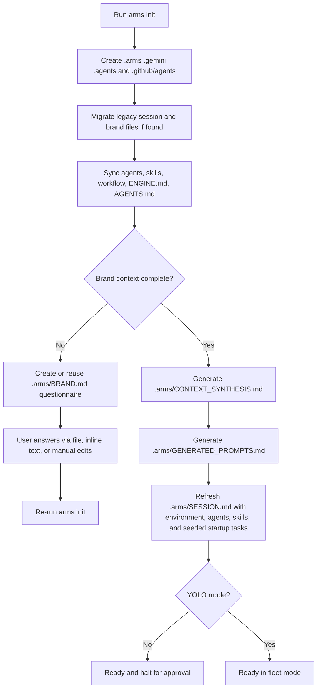

# ARMS — Architectural Runtime Management System

> **Multi-agent orchestration for full-stack delivery with persistent project state.**

ARMS is a Python-powered orchestration engine that bootstraps a project workspace for AI-assisted delivery. It installs a local control plane for planning, memory, skills, workflow references, and agent discovery so the same project can be resumed consistently across sessions.

The engine is optimized for **structured execution**, not just one-off prompting:
- it creates a persistent task board in `.arms/SESSION.md`
- it separates project state from global engine logic
- it captures brand, stack, and product context in `.arms/BRAND.md`
- it synthesizes intake into a concise AI-ready brief in `.arms/CONTEXT_SYNTHESIS.md`
- it generates thin reusable prompts and seeds startup tasks once intake is complete

---

## What ARMS Actually Does

At a high level, `arms init` turns a folder into an ARMS-managed workspace:



---

## Core Architecture

ARMS uses a **hub-and-spoke** model.

### 1. Global engine

The installed package acts as the central engine:
- `arms_engine/agents/` — agent instruction files, mirrored into project agents with runtime rules sourced from `arms_engine/agents.yaml`
- `arms_engine/skills/` — skill directories containing `SKILL.md`
- `arms_engine/workflow/` — reusable workflow protocols
- `arms_engine/agents.yaml` — canonical agent registry

### 2. Local project instance

When you run `arms init`, ARMS writes project-local state and mirrors:

| Path | Purpose | Notes |
|---|---|---|
| `.arms/SESSION.md` | Live orchestration board | Stores environment, compact hot-context agent/skill references, bound-but-inactive skill visibility, approved memory signals, session-derived memory suggestions, task table, blockers, and is kept within a token budget |
| `.arms/SESSION_ARCHIVE.md` | Permanent task history | Created if missing and preserved across re-runs |
| `.arms/BRAND.md` | Brand + stack + product intake | Inferred for existing repos, questionnaire-driven for new projects |
| `.arms/CONTEXT_SYNTHESIS.md` | AI-ready project brief | Summarizes approved brand + stack answers into a compact execution brief, including workspace mode and current stack recommendation |
| `.arms/MEMORY.md` | Persistent project memory | Created if missing, migrated from legacy `.gemini/MEMORY.md`, and updated only after explicit user approval; append-only by convention |
| `.arms/ENGINE.md` | Managed ARMS engine instructions | Re-synced from the engine on every `arms init` |
| `.arms/RULES.md` | Project rules and guardrails | Created if missing and migrated from legacy rule files |
| `.arms/GENERATED_PROMPTS.md` | Agent-ready prompts derived from intake | Generated only when the brand brief is complete; stays intentionally thin and references `.arms/CONTEXT_SYNTHESIS.md` as the dense context source |
| `GEMINI.md`, `.gemini/GEMINI.md`, or `.github/copilot-instructions.md` | Project-owned workspace instructions | Preserved if already present; ARMS scans these locations for context and does not overwrite them |
| `.gemini/agents/` | Local mirror of agent markdown files | Synced from `arms_engine/agents/` |
| `.gemini/agents.yaml` | Local mirror of the canonical agent registry | Synced directly from `arms_engine/agents.yaml` |
| `.arms/workflow/` | Local mirror of workflow docs | Copied from the engine for cross-CLI use |
| `.arms/reports/` | Shared report output directory | Used by review, fix, and deploy protocols |
| `.arms/agent-outputs/` | Shared generated asset/output directory | Used for agent-produced files such as media assets |
| `.agents/skills/` | Local skill mirror for CLI discovery | Only valid skill directories with `SKILL.md` are synced |
| `.agents/skills.yaml` | Generated skill registry | Built from synced skill metadata |
| `.agents/skills-index.md` | Human-readable skill index | Generated quick reference |
| `.github/agents/` | Copilot CLI agent discovery | Synced from engine agent files |
| `.github/skills/` | Copilot skill mirror | Synced from valid `arms_engine/skills/*/SKILL.md` directories |
| `.github/skills.yaml` | Generated Copilot skill registry | Built from synced skill metadata |
| `.github/skills-index.md` | Human-readable Copilot skill index | Generated quick reference |
| `AGENTS.md` | Copilot instruction file at project root | Re-synced from the engine |

---

## Installation

### Recommended: global install with `pipx`

```bash
pipx install git+https://github.com/imjohnlouie04/Arms-Engine.git
```

Then use ARMS in any project:

```bash
cd path/to/project
arms init
```

### Development install

```bash
git clone https://github.com/imjohnlouie04/Arms-Engine.git
cd Arms-Engine
pip install -e .
```

### Regression tests

```bash
python -m unittest discover -s tests -p "test_*.py"
```

### Requirements

- Python `>= 3.8`
- `pyyaml`

---

## CLI Surface

The package exposes two entry points:

| Command | What it does |
|---|---|
| `arms` | Main workspace bootstrap CLI, diagnostics, task/memory workflow, release validation, and protocol runner (`init`, `start`, `doctor`, `task log`, `task update`, `task done`, `memory draft`, `memory append`, `release check`, `run review`, `fix issues`, `run deploy`, `run pipeline`, `run status`) |
| `arms-docs` | Updates the README agent roster block from `agents.yaml` |

`arms --version` and `arms-docs --version` are also supported.

The documented shell linker path, `bash init-arms.sh`, now preserves the caller's `PYTHONPATH`, prepends the engine checkout, and executes `python3 -m arms_engine.init_arms`, so it uses the current source tree directly.

---

## Internal Module Layout

The public CLI entrypoint stays at `arms_engine.init_arms:main`, but the init implementation is now split into focused modules so changes are easier to isolate and test:

| Module | Responsibility |
|---|---|
| `arms_engine/cli.py` | CLI argument parsing, watch mode, confirmation prompts, and init orchestration |
| `arms_engine/brand.py` | Brand inference, questionnaire rendering, structured-answer parsing, and brand updates |
| `arms_engine/compression.py` | Native workspace compression for `arms init compress`, including session archiving, memory compaction, and history summaries |
| `arms_engine/doctor.py` | Workspace diagnostics for `arms doctor`, including sync checks, ownership safety, and protocol readiness |
| `arms_engine/memory.py` | Structured memory workflow for drafting and approving lessons in `.arms/MEMORY.md` |
| `arms_engine/release.py` | Read-only pre-release validation flow that reuses doctor diagnostics and emits a shipping summary |
| `arms_engine/prompts.py` | Context synthesis, generated prompts, and seeded startup tasks |
| `arms_engine/protocols.py` | Protocol command dispatch, session/report updates, pipeline status summaries, and release-note scaffolding |
| `arms_engine/tasks.py` | Executable task-ledger commands for logging, updating, routing, and archiving `.arms/SESSION.md` rows |
| `arms_engine/skills.py` | Agent/skill sync, discovery, metadata parsing, mirrored runtime-rule injection, and registry generation |
| `arms_engine/session.py` | Legacy migration, version guard, task-table normalization, and atomic `SESSION.md` updates |
| `arms_engine/init_arms.py` | Compatibility shim, stable script entrypoint, and executable module wrapper for `python -m arms_engine.init_arms` |

---

## `arms init` In Detail

`arms init` is the main entry point. Internally it performs these steps in order:

1. Resolves the active project root.
2. Refuses to initialize the home directory as a safety guard.
3. Creates required folders such as `.arms/`, `.gemini/`, `.agents/skills/`, `.github/agents/`, and `.github/skills/`.
4. Migrates legacy state into `.arms/` and `.gemini/` when older files are found, including previous root-level layouts such as `SESSION.md`, `RULES.md`, `agents.yaml`, and legacy `.gemini/RULES.md`.
5. Scaffolds missing runtime files like `.arms/MEMORY.md`, `.arms/RULES.md`, and `.arms/SESSION_ARCHIVE.md`, including the default memory approval gate in `.arms/RULES.md`.
6. Removes obsolete Gemini-side skill mirrors and rebuilds the canonical skill mirrors under `.agents/skills/` and `.github/skills/`, along with each mirror's `skills.yaml` and `skills-index.md`.
7. Syncs agents, skills, workflow docs, `.arms/ENGINE.md`, and root `AGENTS.md`.
8. Creates or refreshes `.arms/BRAND.md` depending on project state.
9. Applies any intake helpers such as `--preset`, `--answers-file`, or `--answers-text`.
10. Generates `.arms/CONTEXT_SYNTHESIS.md` when the intake is complete.
11. Generates `.arms/GENERATED_PROMPTS.md` as a thin prompt layer that points back to that synthesized brief.
12. Refreshes `.arms/SESSION.md` with environment metadata, compact hot-context agent/skill references, memory signals distilled from approved `.arms/MEMORY.md` lessons, session-derived memory suggestions from active tasks/blockers, and task sections. On a fresh new-project init, ARMS seeds the startup task table if it is still empty. After bootstrap, the task table acts as the durable ledger for new user asks: each prompt should create or update a row, be assigned to the proper specialist agent, and can be managed directly with `arms task log`, `arms task update`, and `arms task done`. Agent-to-skill bindings come directly from `arms_engine/agents.yaml`, while every valid skill directory is mirrored into `.agents/skills/` and `.github/skills/`.
13. Measures token budgets for `.arms/SESSION.md`, `.arms/CONTEXT_SYNTHESIS.md`, and `.arms/GENERATED_PROMPTS.md` so oversized hot-context output is surfaced immediately during init and later enforced by `arms doctor`.
14. Refuses to continue if an older installed engine tries to re-sync a project that was last synced by a newer engine version, unless you explicitly override the downgrade guard. Development/local-version builds still warn, but the bypass is now tied to dev-style version strings instead of any checkout that merely contains a `.git` directory.
15. If the command includes `compress`, or if workspace state crosses the compaction thresholds, runs the native caveman-style compression pass over `.arms/SESSION.md`, `.arms/MEMORY.md`, and oversized archive history.
16. Ends in either standard halt mode or YOLO-ready mode.

### Standard mode

```bash
arms init
```

Use this when you want the normal approval-driven workflow. If brand context is incomplete, ARMS prints the questionnaire path and halts until you fill it.

### `start` alias

The parser also accepts:

```bash
arms start
```

At the moment, `start` follows the same bootstrap path as `init`.

### YOLO mode

```bash
arms init yolo
```

This enables the YOLO flag in the generated session state and changes the completion message to fleet mode. It also auto-accepts a session context overwrite if an existing `SESSION.md` points to a different project root.

### Activity monitor HUD

```bash
arms init --monitor
```

This opens a local browser HUD and writes a live debug report to `.arms/reports/init-monitor-latest.html` while init runs.

Use it when you want step-by-step visibility into:
- folder setup and legacy migration
- agent/skill/workflow sync
- brand/context generation
- session refresh and completion state

The HUD is opt-in so normal `arms init` stays quiet. The generated HTML report remains in the project for later debugging even after the command exits.

### Compression mode

```bash
arms init compress
```

This now runs a **native ARMS compression pass** after the normal init sync:

- archives `Done` / `Cancelled` active-task rows into `.arms/SESSION_ARCHIVE.md`
- clears bulky `Completed Tasks` noise from `.arms/SESSION.md`
- rewrites `.arms/MEMORY.md` into dense caveman-style notes while preserving section headings
- refreshes `.arms/HISTORY_SUMMARY.md` when archive history grows beyond the compression threshold
- prints archive diagnostics with the exact archive/history-summary paths touched during compression

It is designed to shrink long-lived workspace state without deleting pending or blocked work.

ARMS also auto-compacts oversized workspace state during normal `arms init` runs when `.arms/SESSION.md`, `.arms/MEMORY.md`, or archive history grows beyond the built-in thresholds.

### Overriding the engine root

```bash
arms init --root /path/to/Arms-Engine
```

Use this mainly for development or when you want to point a project at a non-default engine location. ARMS accepts either the repository root (for example `Arms-Engine/`) or the package directory itself (`Arms-Engine/arms_engine/`) and normalizes it to the internal package root before syncing files or recording the path in `.arms/SESSION.md`.

### Allowing an intentional downgrade

```bash
arms init --allow-engine-downgrade
```

ARMS now records the engine version in `.arms/SESSION.md`. If a project was last synced by a newer engine and you run `arms init` from an older install, init stops and tells you to upgrade instead of silently downgrading project state.

If ARMS can also see a newer local git checkout of the engine, the downgrade warning includes an exact `PYTHONPATH=... python -m arms_engine.init_arms ...` rerun command so you can switch to that checkout immediately without guessing the invocation.

When ARMS is running directly from a git checkout, the recorded version is derived from the current git tag/describe output instead of relying only on a generated `_version.py`, so tagged updates display the expected release version in local development too.

Use `--allow-engine-downgrade` only when you intentionally want an older engine to re-sync the project.

### Watch mode / auto-resume

```bash
arms init --watch
```

When init halts because `.arms/BRAND.md` is still incomplete, watch mode keeps the process alive, watches the brand file, and automatically reruns `arms init` after the file changes.

This is useful when you want to:
- open `.arms/BRAND.md` in an editor
- fill in the missing fields
- let ARMS resume automatically without manually rerunning the command

Watch mode only auto-resumes the brand-intake checkpoint. Press `Ctrl+C` to stop watching.

### Doctor mode

```bash
arms doctor
arms doctor --fix
```

`arms doctor` inspects the current workspace and exits non-zero when it finds blocking problems.

It now validates hot-context token budgets for:
- `.arms/SESSION.md`
- `.arms/CONTEXT_SYNTHESIS.md`
- `.arms/GENERATED_PROMPTS.md`

It also reports version diagnostics for:
- git tag / latest tag
- git describe output
- runtime `__version__`
- generated `arms_engine/_version.py`
- installed package metadata

and always ends with a compact final triage block that separates:
- blocking issues
- warnings
- safe repairs applied
- repair notes that were skipped

When `arms doctor --fix` removes obsolete managed artifacts, those removals are now listed explicitly in the repair output instead of being hidden behind the generic resync summary.

`arms run status` now also distinguishes:
- **failed tasks** recorded by ARMS in `SESSION.md`
- **cancelled tasks** that should usually be treated as external runtime/operator cancellations unless the user explicitly cancelled them

`arms doctor --fix` safely resyncs engine-owned mirrored files first (`.gemini/agents*`, mirrored skills and registries, `.arms/workflow/`, `.arms/ENGINE.md`, and root `AGENTS.md`) and then reports anything still unsafe or incomplete. It does not bootstrap a missing workspace and it does not overwrite project-owned instruction files.

It checks:

- required `.arms/`, `.agents/`, `.gemini/`, and `.github/agents/` files and directories
- `.arms/SESSION.md` structure and engine-version compatibility
- agent, skill, and workflow mirror sync
- engine-managed file sync for `.arms/ENGINE.md` and root `AGENTS.md`
- project-owned instruction file detection (`GEMINI.md`, `.gemini/GEMINI.md`, `.github/copilot-instructions.md`)
- readiness for `run review`, `fix issues`, and `run deploy`

Warnings do not fail the command, but blocking issues do.

### Release validation mode

```bash
arms release check
```

`arms release check` is a read-only pre-release gate built on top of the same diagnostics stack as `arms doctor`.

It adds a shipping summary that condenses:
- blocking categories
- warning categories
- ready categories
- a version snapshot from runtime / git describe / latest tag
- the recommended next command before shipping

The command exits non-zero when blocking issues are present, stays read-only even when warnings exist, and leaves all repair behavior in `arms doctor --fix`.

### Structured memory workflow

```bash
arms memory draft --section "Known Bugs & Fixes" --lesson "Preserve session memory signals during re-init."
arms memory draft --from-suggestion 1
arms memory append --draft-id memory-20260501-01
```

Use `arms memory draft` to stage a lesson in `.arms/MEMORY.md` with a **pending approval** marker.

Use `arms memory append` to approve the lesson and refresh `## Memory Signals` in `.arms/SESSION.md`.

Notes:
- pending entries are stored with `[PENDING APPROVAL][memory-YYYYMMDD-NN]: ...`
- approved entries are stored with `[APPROVED][memory-YYYYMMDD-NN]: ...`
- only approved entries are surfaced into `## Memory Signals`
- `## Memory Suggestions` in `.arms/SESSION.md` is generated automatically from active tasks and blockers so deeper sessions still surface candidate lessons
- `arms memory draft --from-suggestion <n>` stages one of those generated suggestions without manually copying the lesson text
- `arms memory append` also supports direct approval with `--section` plus `--lesson`

### Structured task workflow

```bash
arms task log --task "Improve responsive dashboard layout and mobile sidebar"
arms task update --task-id 6 --status "In Progress"
arms task done --task-id 6
```

Use `arms task log` to add a new `.arms/SESSION.md` row or update an exact matching open task without duplicating it.

Use `arms task update` to change task text, routing, dependencies, or status on an existing row.

Use `arms task done` to mark a row complete and archive it out of hot context immediately.

Notes:
- new task rows infer the proper specialist agent from task text unless `--assigned-agent` overrides it
- `Active Skill` is auto-filled from the assigned agent's bound skills in `arms_engine/agents.yaml`
- `Done` / `Cancelled` rows are removed from `.arms/SESSION.md` and appended to `.arms/SESSION_ARCHIVE.md`
- task commands require an initialized workspace, just like the memory workflow

---

## New Intake Features

The newer `init` flow is designed to collect structured project context before heavy implementation begins.

### 1. Presets with `--preset`

```bash
arms init --preset local-business
```

`--preset` fills **unanswered** fields in `.arms/BRAND.md` with opinionated defaults for a common project shape. It is meant to accelerate intake, not overwrite a fully written brief.

Available presets:

| Preset | Best for | What it pre-fills |
|---|---|---|
| `local-business` | Service businesses and local lead-generation sites | local SEO, CTAs, trust sections, contact visibility, service-gallery style content |
| `saas` | Product-led SaaS sites and app marketing | feature sections, pricing, onboarding clarity, product screenshots, conversion-oriented messaging |
| `portfolio` | Personal or agency portfolios | featured work, case studies, about/process, contact and proof-of-work structure |
| `ecommerce` | Storefronts and commerce-led projects | collections, product highlights, reviews, shipping/returns, purchase CTAs |
| `content-site` | Editorial or content-marketing properties | featured content, topic sections, newsletter CTA, content hierarchy, discoverability |

Each preset can populate fields such as:
- `Project Type`
- `Design Priority`
- `Voice & Tone`
- `Typography`
- `Icon System`
- `Experience Type`
- `Required Website Sections`
- `Primary Calls to Action`
- `Image Requirements`
- `SEO Focus`
- `Technical Constraints`

**Important:** preset application is non-destructive by default. If a field already contains a real answer, the preset leaves it alone.

### 2. Structured answer ingestion with `--answers-file`

```bash
arms init --answers-file .arms/answers.md
```

This reads a structured answer block from a file and applies it into `.arms/BRAND.md`.

It also supports stdin:

```bash
cat answers.md | arms init --answers-file -
```

### 3. Structured answer ingestion with `--answers-text`

```bash
arms init --answers-text "Mission: Build a modern local HVAC website"
```

Use this when you want to pass a compact answer block inline from the terminal.

### 4. Supported answer formats

The parser accepts multiple structured formats:

```text
Mission: Build a modern local HVAC website
Primary Audience: Homeowners in Metro Manila
Preferred Tech Stack: Next.js + Supabase
```

```text
- **Mission:** Build a modern local HVAC website
- **Primary Audience:** Homeowners in Metro Manila
- **Preferred Tech Stack:** Next.js + Supabase
```

```text
1. Project name: Arctic Flow
2. Mission: Generate qualified HVAC leads
3. Core features: Landing pages, quote forms, SEO pages
```

It also supports the questionnaire shortcuts directly:

```text
11. A
12. 1
```

Where the current built-in stack shortcuts are:
- `A` -> `Next.js + Supabase + shadcn/ui (latest stable)`
- `B` -> `Nuxt + Firebase + Nuxt UI (latest stable)`
- `C` -> `Astro + Tailwind CSS + DaisyUI (latest stable)`
- `D` -> `Custom`

The parser can also map friendly aliases such as:
- `working title` -> `Project Name`
- `voice and tone` -> `Voice & Tone`
- `target audience` -> `Primary Audience`
- `brand comparison` -> `Brand Comparison`
- `existing assets` -> `Existing Brand Assets`

### 5. Derived field behavior

Structured answers can also help fill related brand fields when they are still empty. For example:
- a primary use case can help infer `Project Type`
- a brand comparison can fill `Differentiation`
- existing asset notes can infer `Logo Status`
- non-negotiables can populate `Technical Constraints`

### 6. Latest stack recommendation behavior

ARMS now treats the stack answer as both a preference and an input to a recommendation pass.

- If the user explicitly selects a supported stack, ARMS records that selection and keeps the recommendation aligned to it.
- If the user leaves the stack vague, marks it custom, or provides incomplete technical direction, ARMS recommends the best-fit stack for the project shape.
- Recommendations stay phrased as **latest stable** instead of hardcoding framework versions into the generated brief.

Current default mappings:

| Stack profile | Recommended UI system | Best default use cases |
|---|---|---|
| Next.js + Supabase | `shadcn/ui` | SaaS, dashboards, ecommerce, authenticated app flows |
| Nuxt + Firebase | `Nuxt UI` | mobile-first products, Nuxt/Vue teams, content-plus-app hybrids |
| Astro + Tailwind CSS | `DaisyUI` | marketing sites, local-service websites, editorial projects, portfolios |

The selected or inferred stack profile is written into `.arms/CONTEXT_SYNTHESIS.md` so downstream agents can build from the same recommendation.

---

## Existing Repository vs New Project Behavior

`arms init` treats these differently on purpose.

### Existing repository

If ARMS detects a real project already exists and no usable brand file is present, it generates `.arms/BRAND.md` from repository signals. This gives you a first-pass brief to review and refine.

### New or empty project

If the folder is effectively empty, ARMS writes a guided questionnaire to `.arms/BRAND.md`. That questionnaire includes:
- brand identity fields
- initial technical direction
- website or landing-page intake fields where relevant

If the questionnaire is incomplete, ARMS reuses it on later `init` runs instead of throwing it away.

---

## Generated Prompts

Once `.arms/BRAND.md` is complete enough to be actionable, ARMS generates:

```text
.arms/CONTEXT_SYNTHESIS.md
.arms/GENERATED_PROMPTS.md
```

`.arms/CONTEXT_SYNTHESIS.md` condenses the intake into an AI-ready brief. It includes:
- the workspace mode (`Existing Repository` vs `New Project`)
- the compact execution policy ARMS is using for that mode
- the approved project and brand summary
- the current ARMS stack recommendation
- confidence signals for confirmed vs still-vague inputs
- a startup sequence summary

`.arms/GENERATED_PROMPTS.md` then uses that synthesis to produce agent-ready prompts. It contains:
- a master build prompt
- a product kickoff prompt
- a DevOps prompt
- a frontend prompt
- a QA prompt
- optional data / backend / security prompts when backend foundation work is needed
- optional media and SEO/content prompts when the project mode and surface call for them

The prompt file is intentionally **thin**: it references `.arms/CONTEXT_SYNTHESIS.md` instead of repeating the full project brief in every prompt block. It also reminds agents to treat clarifying replies and issue follow-ups inside an active generated/custom prompt as continuation of the same task unless the user introduces a net-new ask.

If the brand brief becomes incomplete again, ARMS removes stale generated prompts rather than leaving outdated prompt output behind.

---

## Session Behavior and Re-Runs

ARMS is intentionally **non-destructive** when you re-run `arms init`.

### What is preserved

- active task sections in `.arms/SESSION.md`
- completed tasks and blockers
- existing memory and rules files
- existing brand content unless it still requires bootstrap
- session archive history

### What is refreshed

- synced agent files
- synced skills and skill registry
- workflow mirrors
- `.arms/ENGINE.md`
- `.arms/CONTEXT_SYNTHESIS.md`
- root `AGENTS.md`
- environment metadata in `.arms/SESSION.md`
- compact active agent and active skill references

### Project-owned instruction file ownership

If a project already has `GEMINI.md` at the root, `.gemini/GEMINI.md`, or `.github/copilot-instructions.md`, ARMS treats those files as **project-owned** documentation. They are preserved as-is and can be read as repository context during brand and project inference, but they are not used as engine-managed instruction targets.

### Why the engine source file is `ENGINE.md`

The engine package now ships its managed instruction source as `arms_engine/ENGINE.md`. During `arms init`, ARMS deploys that engine-owned file into the project workspace as `.arms/ENGINE.md`, while any project-owned `GEMINI.md` or `.github/copilot-instructions.md` remains separate and untouched.

### Task table normalization

If ARMS finds an older `SESSION.md` task table shape, it upgrades it to the current schema:

| # | Task | Assigned Agent | Active Skill | Dependencies | Status |
|---|---|---|---|---|---|

On re-sync, ARMS also repairs stale `Active Skill` cells in existing task rows. If a task still shows `—` but the assigned agent now has a bound skill in `arms_engine/agents.yaml`, `arms init` backfills the correct skill automatically.

For live task updates after bootstrap, prefer the executable ledger commands: `arms task log`, `arms task update`, and `arms task done`.

### Startup task seeding

When a new project finishes intake and the active task table is still empty, ARMS seeds an initial startup sequence in `.arms/SESSION.md`. Existing repositories get review-first startup tasks; new projects get scaffold-first startup tasks. Backend/security/media/SEO tasks are added only when the project shape calls for them.

### Context mismatch protection

If an existing session file points to a different project root, ARMS now raises that decision to the CLI layer instead of prompting from deep inside session-writing logic. Interactive runs warn before overwriting the session context, non-interactive runs refuse to overwrite automatically, and YOLO mode still auto-accepts.

### Legacy migration

Older files such as legacy session logs or brand files are moved into the newer `.arms/` layout when possible.
Legacy `.gemini/MEMORY.md` is also migrated into `.arms/MEMORY.md` when the `.arms/` target does not already exist.

---

## How to Use ARMS in Practice

### Fastest new-project path

```bash
arms init --preset saas
```

Then complete any remaining blanks in `.arms/BRAND.md` and re-run:

```bash
arms init
```

### File-driven intake path

```bash
arms init --preset local-business --answers-file .arms/answers.md
```

### Minimal inline path

```bash
arms init --answers-text "Mission: Build a conversion-focused portfolio site"
```

### Practical workflow

1. Run `arms init`.
2. If ARMS asks for brand context, answer the generated questionnaire or use the intake flags.
3. Re-run `arms init` until `.arms/CONTEXT_SYNTHESIS.md` and `.arms/GENERATED_PROMPTS.md` are produced.
4. Review `.arms/SESSION.md` for environment, compact agent/skill references, and the seeded startup task structure.
5. Use the synced agents, skills, synthesis brief, and generated prompts in your AI workflow.

---

## Orchestration Protocol Commands

After initialization, the `arms` CLI also accepts protocol commands that work against the local `.arms/` workspace state:

- `arms run status` — reads `.arms/SESSION.md` and prints the current phase, active tasks, blockers, and last completed work
- `arms run review` — stages review tasks in `.arms/SESSION.md` and scaffolds `./.arms/reports/review-<YYYY-MM-DD>.md`
- `arms fix issues` — parses the latest review report's `## Actionable Issues` bullets into a fix plan and updates the task board
- `arms run deploy` — stages deployment tasks and generates `./.arms/reports/release-notes-<YYYY-MM-DD>.md`
- `arms run pipeline` — resets the protocol sequence to the Review phase and scaffolds the review report

These commands deliberately stop at approval gates. They update `SESSION.md` and create protocol artifacts in `.arms/reports/`, but they do **not** yet execute full autonomous subagent remediation or remote deployment from the Python CLI alone.

---

## `arms-docs`

The `arms-docs` command maintains the README agent roster automatically.

```bash
arms-docs
```

What it does:
1. Reads `arms_engine/agents.yaml`
2. Extracts agent names, roles, and scopes
3. Rewrites only the content between:
   - `<!-- AGENT_ROSTER_START -->`
   - `<!-- AGENT_ROSTER_END -->`

This means you can freely improve the rest of the README without losing your manual documentation, as long as you keep those markers intact.

---

## Updating and Versioning

### Upgrade a standard install

```bash
pipx upgrade arms-engine
```

### Refresh a development checkout

```bash
cd /path/to/Arms-Engine
git pull
pip install -e .
```

### Release tagging

ARMS uses `setuptools-scm`, so Git tags drive the package version:

```bash
git tag v1.1.0
git push origin v1.1.0
```

---

## Agent Roster

ARMS dynamically discovers agents and their skills from `agents.yaml`.

<!-- AGENT_ROSTER_START -->
- **`arms-main-agent`** (Orchestrator): Planning, delegation, session management.
- **`arms-product-agent`** (Product Manager): Requirements gathering, user stories, PRD generation, feature prioritization.
- **`arms-backend-agent`** (Backend Specialist): APIs, models, auth, backend services.
- **`arms-frontend-agent`** (Frontend Specialist): UI components, routing, state, API integration.
- **`arms-devops-agent`** (DevOps Specialist): CI/CD, deployment, boilerplate initialization based on chosen tech stack.
- **`arms-seo-agent`** (SEO Specialist): Search engine optimization, meta tags, semantic HTML validation, schema markup, Core Web Vitals.
- **`arms-media-agent`** (Media Specialist): Asset creation.
- **`arms-data-agent`** (Data Specialist): Schema design, migrations, query optimization.
- **`arms-qa-agent`** (QA & Testing Specialist): Writing unit/E2E tests, performing pre-flight validation.
- **`arms-security-agent`** (Security Specialist): Enforces OWASP standards, validates auth flows, configures RLS, audits dependencies.
<!-- AGENT_ROSTER_END -->

---

## Skill System

A skill in ARMS is a directory that contains a required `SKILL.md` file plus optional supporting material.

```text
skills/
  └── my-skill/
      ├── SKILL.md
      ├── references/
      └── scripts/
```

Only directories containing `SKILL.md` are treated as valid skills during sync and registry generation.

---

## Workflow Protocols

ARMS mirrors reusable workflow references into `.arms/workflow/`.

Current protocol files include:
- `DEPLOY_PROTOCOL.md`
- `REVIEW_PROTOCOL.md`
- `FIX_ISSUE_PROTOCOL.md`

These documents define how review, remediation, and deployment workflows should be approached inside an ARMS-managed project.

---

## Core Principles

1. **Planning before execution** — ARMS favors explicit task structure over ad-hoc execution.
2. **Persistent project state** — session, memory, brand context, and archives survive across runs.
3. **Split installation** — global engine logic stays in the package; project state lives in the repo.
4. **Non-destructive sync** — repeated `init` runs refresh mirrors without discarding active work.
5. **Structured intake first** — presets and answer ingestion exist to make downstream agent work more accurate.

---

*ARMS orchestrates. You decide.*
